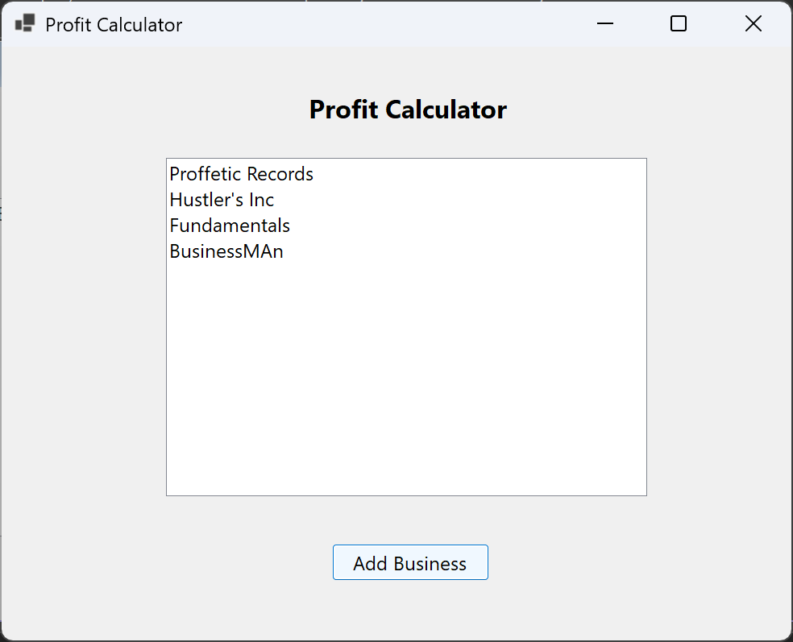
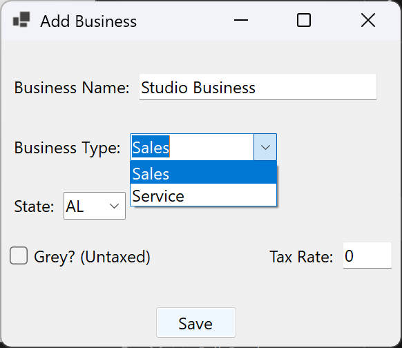
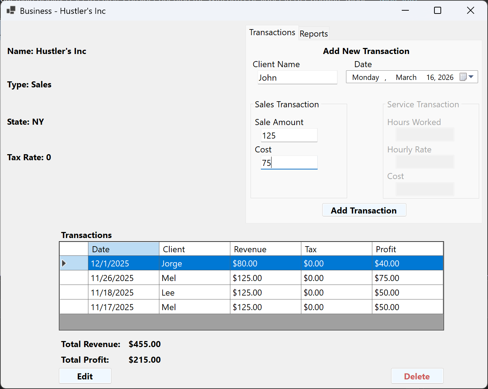

# Profit Calculator (C# Windows Forms)

A desktop application built with **C# and .NET Windows Forms** that allows users to manage businesses, record financial transactions, and calculate profit.

The application demonstrates object-oriented programming, multi-form desktop UI design, and persistent data storage using text files.

---

## Features

• Create and manage multiple businesses  
• Add revenue and expense transactions  
• Edit existing transactions  
• Automatically calculate business profit  
• Persist data between sessions using text file storage

The application stores data in text files generated when the program runs:

- businesses.txt
- transactions.txt

---

## Technologies Used

- C#
- .NET 8 Windows Forms
- Object-Oriented Programming
- File I/O (text file persistence)
- Visual Studio

---

## Project Structure

Business.cs  
Transaction.cs  
HomeForm.cs  
BusinessForm.cs  
AddBusinessForm.cs  
EditTransactionsForm.cs  
Program.cs  

### Core Classes

**Business**  
Represents a business entity and tracks its transactions.

**Transaction**  
Represents a financial record such as revenue or expense.

---

## How It Works

1. The application loads existing data from text files when it starts.
2. Users can create businesses and record transactions through the UI.
3. Transactions are associated with businesses and used to calculate profit.
4. All changes are saved to text files so data persists between sessions.

---

## Screenshots

### Home Screen

### Business Management

### Transactions

---

## Future Improvements

• Replace text storage with a database (SQLite or SQL Server)  
• Add reporting and financial summaries  
• Improve UI layout and validation  
• Export financial reports

---

## Author

Jorge Morales  
NYU – Information Systems Management
