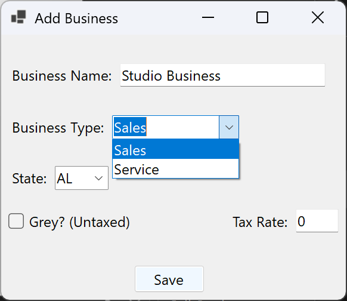
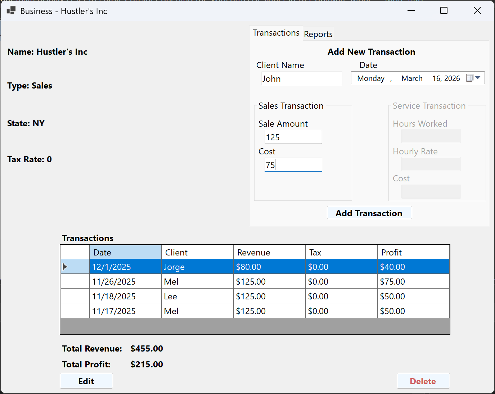

# Profit Calculator

A C# Windows Forms desktop application for tracking businesses, recording financial transactions, and calculating profit across different business scenarios. Built as my first full project to practice object-oriented design, multi-form UI architecture, and file-based persistence.

---

## Features

- Create and manage multiple businesses
- Record revenue and expense transactions
- Edit existing transactions
- Calculate profit per business automatically
- Persist data between sessions via text file storage

---

## How It Works

1. The application loads existing data from `businesses.txt` and `transactions.txt` on startup
2. Users create businesses and record transactions through the multi-form UI
3. Transactions are associated with businesses and used to compute profit
4. All changes are written back to the text files so data persists between sessions

---

## Screenshots

**Business Management:**

**Transactions:**

---

## Core Classes

- **Business** — Represents a business entity and tracks its associated transactions
- **Transaction** — Represents a financial record (revenue or expense) linked to a business

---

## Technologies

- C#
- .NET 8 Windows Forms
- Object-Oriented Programming
- File I/O for persistence
- Visual Studio

---

## What I'd Do Differently

This was my first project, and the file-based persistence reflects that. A v2 would:

- Replace text file storage with SQL Server (which I've since learned and applied in [middle-school-database](https://github.com/the1JM/middle-school-database))
- Add reporting and financial summary views
- Improve input validation and UI layout
- Add export to CSV or PDF

---

## Author

Jorge Morales — NYU Information Systems Management
